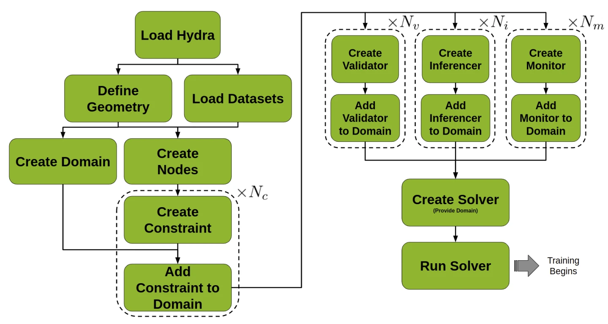
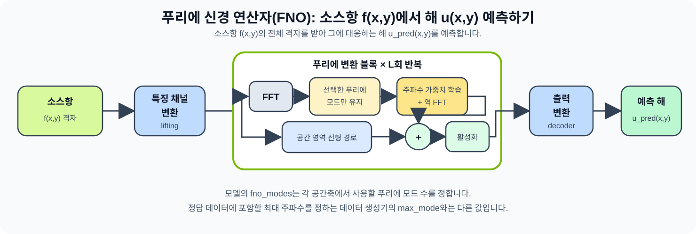

# 02_PhysicsNeMo — 물리식을 이용한 학습과 신경 연산자

이 모듈은 서로 다른 두 Physics AI 문제를 다룹니다. 발사체 운동 PINN은 선택한 초기속도와 발사각에서 시간에 따른 궤적을 구하고, Poisson FNO는 여러 소스항과 해의 예를 학습해 처음 보는 소스항의 전체 해를 예측합니다.

참가자는 물리 실험값, 해석해 코드, ODE 잔차 목표값, FFT 직접해법, FNO 모드 수, 학습 단계 수를 직접 수정하고 예측·학습·비교·해석까지 수행합니다.

## 학습 목표

- 신경망 예측값을 운동방정식에 넣었을 때 남는 값인 **방정식 잔차**가 PINN의 학습 손실이 되는 원리를 설명합니다.
- PhysicsNeMo-Sym의 `Node`, `Constraint`, `Domain`, `Validator`, `Inferencer`, `Solver`를 실제 코드에서 찾습니다.
- FNO가 FFT로 공간 패턴을 주파수 성분으로 나누고, 선택한 성분을 학습해 해를 예측하는 과정을 설명합니다.
- 별도 테스트 데이터에서 학습 전후 오차를 비교하고 실행 시간·GPU 메모리 측정값을 해석합니다.
- 모델이 HBM에 들어가지 않을 때 GH200에서 어떤 선택지가 생기는지 확인합니다.

## 모듈 안내

| 시간 | 필수 동선 | 참가자 활동 | 핵심 결과 |
|---|---|---|---|
| 14:40–16:00 | [02-1 발사체 운동 PINN](01_Projectile_PINN.ipynb) | 초기속도(25–40 m/s)·발사각(25–65°) 선택 → 해석해 두 줄 완성 → ODE 잔차 목표값 확인 → 학습 → 특정 시점 예측 비교 | `validator.npz`, 상대 L2·최대 절대 오차, 궤적 그래프 |
| 16:10–17:30 | [02-2 Poisson FNO](02_Poisson_FNO.ipynb) | 테스트 표본 선택 → FFT 직접해법 한 줄 완성 → `fno_modes`·학습 단계 설정 → 학습 전후 테스트 오차 비교 → **GH200 통합 메모리로 HBM 초과 텐서 처리** | 테스트 지표 JSON, 입력·정답·예측·오차 그림 |
| 조기 완료 | [FNO 모드 수 통제 비교](optional/FNO_Mode_Ablation.ipynb) | 다른 조건을 고정하고 모드 6개·12개 실행 → 시간·모델 크기·메모리·오차 비율 계산 | 두 설정의 비교표와 그래프 |

## PINN에서 FNO로

| 구분 | 발사체 운동 PINN | Poisson FNO |
|---|---|---|
| 입력 | 시간 `t` | 격자에 주어진 소스항 `f(x,y)` |
| 출력 | 위치 `x(t), y(t)` | 격자 전체의 해 `u(x,y)` |
| 학습 자료 | 네 개의 초기조건과 운동방정식 | 여러 소스항과 정답 해의 쌍 `(f,u)` |
| 학습 후 사용 | 같은 조건의 특정 시점 위치 예측 | 처음 보는 소스항의 전체 해 예측 |
| 평가 | 해석해와 궤적 오차 비교 | 별도 테스트 데이터에서 예측 오차 계산 |

수학에서 **연산자(operator)**는 입력 함수 하나를 출력 함수 하나에 대응시키는 규칙입니다. 이 실습에서는 이를 **소스항의 공간 분포가 바뀔 때 해의 공간 분포를 어떻게 구할지 학습하는 모델**로 구체화합니다.

## PhysicsNeMo-Sym 학습 구성

<em>그림 1. PhysicsNeMo-Sym의 학습 구성 절차. 설정·방정식·모델·학습 조건·평가 항목을 Domain에 등록하고 Solver를 실행하는 공통 흐름입니다.</em>

| 그림의 라벨 | 발사체 PINN 코드 | 역할 |
|---|---|---|
| Load Hydra | `labs/projectile/source_code/conf/config.yaml` | 신경망·최적화 방법·학습 단계 설정 |
| Define Geometry | `Point1D(0)` + 시간 parameterization | Constraint API의 고정점과 실제 입력 시간 샘플링 |
| Load Datasets | 사용하지 않음 | PINN 학습에는 정답 궤적 데이터셋이 필요하지 않음 |
| Create Nodes | `ProjectileEquation` + `projectile_net` | `t → x̂,ŷ`와 자동미분 잔차 계산 |
| Create Constraint | `initial_condition`, `ode_constraint` | 초기조건과 운동방정식을 학습 손실로 등록 |
| Create Validator | `validator` | 학습 구간에서 해석해와 예측 비교 |
| Create Inferencer | `grid_inference` | 더 넓은 시간 구간에서 정답 없이 예측 생성 |
| Create Monitor | 사용하지 않음 | 이 실습에서는 별도 모니터를 등록하지 않음 |
| Create Domain | `projectile_domain` | Constraint 2개, Validator 1개, Inferencer 1개 등록 |
| Create/Run Solver | `Solver(cfg, projectile_domain).solve()` | 등록한 구성으로 학습 실행 |

`N_c`, `N_v`, `N_i`, `N_m`은 Domain에 등록한 Constraint, Validator, Inferencer, Monitor의 개수를 나타냅니다. 발사체 실습은 `N_c=2`, `N_v=1`, `N_i=1`, `N_m=0`입니다.

출처: [NVIDIA PhysicsNeMo-Sym User Guide — PINNs Tutorials](https://docs.nvidia.com/physicsnemo/25.11/user-guide/pinns-tutorials/index.html)

## FNO 데이터 흐름

<em>그림 2. FNO 모델 내부의 데이터 흐름. 입력 소스항 `f`를 특징 채널로 확장하고, 푸리에 변환 블록을 거쳐 예측 해 `u_pred`를 출력합니다.</em>

1. 특징 채널 변환(lifting)이 소스항 `f(x,y)`를 여러 내부 특징 채널로 확장합니다.
2. FFT가 공간 패턴을 주파수별 성분으로 표현합니다.
3. 각 층은 선택한 푸리에 모드에 학습 가능한 가중치를 적용하고 역 FFT를 수행합니다.
4. 주파수 경로와 공간 영역의 선형 경로를 더한 뒤 활성화 함수를 적용합니다.
5. 출력 변환부(decoder)가 격자 전체의 예측 해 `u_pred(x,y)`를 만듭니다.

데이터 생성기의 `max_mode`는 합성 소스항에 포함할 최고 주파수를 정합니다. 모델의 `fno_modes`는 FNO 각 층에서 유지할 푸리에 성분의 수를 정합니다.

### FNO 코드 대응

| 구성 요소 | `labs/poisson_fno/train_fno.py` | 역할 |
|---|---|---|
| Hydra 설정 | `conf/config_FNO*.yaml` | 모델·배치·학습 단계 설정 |
| Dataset | `DictGridDataset(invar, outvar)` | HDF5의 `(f,u)` 쌍 제공 |
| Node | `fno.make_node("fno")` | `f → u_pred` 계산 그래프 |
| Constraint | `SupervisedGridConstraint` | 학습 데이터의 예측·정답 오차 최소화 |
| Validator | `GridValidator` | 가중치를 바꾸지 않고 검증 데이터 평가 |
| Domain | `domain.add_constraint`, `add_validator` | 학습·검증 구성 등록 |
| Solver | `Solver(cfg, domain).solve()` | 학습 반복과 체크포인트 저장 |
| 별도 테스트 평가 | `evaluate_held_out_test(...)` | 학습 전과 학습 후 모델을 같은 테스트 분할에서 비교 |

## 행사 환경 — 설치하지 않습니다

KSC2026 계산 노드는 인터넷을 사용하지 않습니다. 참가자가 `apt`, `pip`, `git clone`, `wget`을 실행할 필요가 없습니다.

| 항목 | 행사 이미지의 고정 환경 |
|---|---|
| 실행 형식 | Apptainer로 실행하는 SIF |
| 플랫폼 | Linux/ARM64(`aarch64`) · GH200 |
| 기반 이미지 | NVIDIA PhysicsNeMo 25.11 |
| Python 배포 패키지 | `nvidia-physicsnemo==1.3.0`, `nvidia-physicsnemo.sym==2.3.0` |
| Python import | `import physicsnemo`, `import physicsnemo.sym` |
| 실습 코드·설정 | SIF와 과정 릴리스에 포함 |

배포 패키지 이름에는 하이픈이나 점이 들어가지만 Python에서 `import nvidia-physicsnemo`라고 쓰지 않습니다. 행사 노트북의 import 이름은 `physicsnemo`와 `physicsnemo.sym`입니다.

SIF는 읽기 전용 실행 환경이고, 참가자가 수정하는 노트북과 생성한 결과는 개인 `/scratch/$USER/ksc2026/` 작업공간에 저장됩니다. 이미지와 작업 파일이 분리되어 있으므로 세션을 다시 시작해도 저장한 노트북과 결과 파일은 남습니다.

## 행사 후 개인 환경

행사 당일에는 필요 없습니다. 개인 환경 설치, 25.11 API 그대로 재현하기, 최신 v2.0으로 옮기기는 [행사 후 안내](https://github.com/yang926/KSC2026-GH200-PhysicsNeMo-Tutorial/blob/main/AFTER_EVENT.md)에 정리했습니다.

## 실습별 생성 파일

| 실습 | 주요 결과 경로 | 확인할 값 |
|---|---|---|
| 발사체 PINN | `labs/projectile/outputs/ksc_projectile/<run>/` | `validators/validator.npz`, `inferencers/inferencer_data.npz`, `prediction.png`, `extrapolation.png`, checkpoint |
| Poisson FNO | `labs/poisson_fno/outputs/ksc_fno_<profile>/<run>/` | `final_state_test_metrics.json`, 테스트 예측 그림, checkpoint |
| 모드 수 비교 | `labs/poisson_fno/outputs/ksc_fno_ablation/<run>/` | 모드 6개·12개 설정별 metrics |

각 실행은 새 이름의 폴더에 결과를 저장합니다. 이전 실행을 이어갈 때는 노트북의 `RESUME_RUN_DIR`에 해당 결과 폴더를 지정합니다.

## 실행 설정

| 설정 | 용도 | 주요 구성 |
|---|---|---|
| `gh200` | GH200 대규모 후보 설정 | 256×256 격자, 학습/검증/테스트 2048/256/256개, 6개 층, 푸리에 모드 32개, 채널 너비 64, 2000단계 |
| `recovery` | 수업용 단축 설정 | 64×64 격자, 학습/검증/테스트 800/100/100개, 4개 층, 푸리에 모드 12개, 채널 너비 32, 400단계 |

> **강사 확인 필수.** `gh200`은 계산량을 높인 후보 설정입니다. 데이터셋 2,560개(256×256) 생성 시간까지 포함해 80분 안에 끝나는지 **행사 전 PILOT GH200 예행연습에서 반드시 실측**해야 합니다. 완주를 확인하지 않았다면 `recovery`로 진행합니다.
>
> 데이터셋을 미리 생성해 중앙 게시본에 포함해 두면 참가자 세션에서 검증만 하고 넘어가므로 수 분을 절약할 수 있습니다.

두 설정은 격자·데이터·모델 크기와 학습 단계가 모두 다르므로 성능 비교용으로 사용하지 않습니다. 한 요인의 효과를 비교하려면 선택 실습처럼 데이터·난수 시드·층 수·채널 너비·배치·학습 단계를 고정하고 `fno_modes`만 바꿉니다.

## 완료 체크리스트

### 발사체 PINN

- [ ] 필수 파일과 PhysicsNeMo-Sym import를 확인했습니다.
- [ ] 선택한 초기속도와 발사각으로 해석해 두 줄을 완성했습니다.
- [ ] `ode_y=y''+g`의 Constraint 목표값이 0인 이유를 설명할 수 있습니다.
- [ ] 학습 프로세스가 종료 코드 0으로 끝났습니다.
- [ ] `validator.npz`에서 상대 L2 오차와 최대 절대 오차를 계산했습니다.
- [ ] 해석해와 PINN 예측 그래프, 학습 구간과 외삽 구간을 구분했습니다.

### Poisson FNO

- [ ] CUDA와 데이터셋 검증을 통과했습니다.
- [ ] FFT 직접해법의 핵심 한 줄을 완성하고 데이터 정답과 비교했습니다.
- [ ] 자동 결과표에서 선택한 `fno_modes`와 학습 단계 수를 확인했습니다.
- [ ] `final_state_test_metrics.json`과 테스트 예측 그림을 확인했습니다.
- [ ] 자동 결과표에서 학습 전후 상대 L2 오차, 전체 실행 시간, 최대 PyTorch GPU 메모리를 확인했습니다.
- [ ] 입력·정답·예측·절대 오차 그림을 해석했습니다.
- [ ] 기본 할당기로는 담기지 않는 텐서를 통합 메모리 할당기로 처리하는 것을 확인했습니다.

## 선택 실습

필수 FNO 실습을 일찍 마친 참가자는 강사 안내 후 [FNO 모드 수 비교](optional/README.md)를 진행합니다.

## 참고 자료

노트북 실행에는 인터넷 연결이 필요하지 않습니다. 아래는 행사 후에 볼 자료입니다.

- [PhysicsNeMo 25.11 문서](https://docs.nvidia.com/physicsnemo/25.11/) — 이 과정의 기준 문서
- [FNO 논문](https://arxiv.org/abs/2010.08895) · [PINN 논문](https://www.sciencedirect.com/science/article/pii/S0021999118307125)
- [OpenHackathons AI-Powered-Physics-Bootcamp 원본 과정](https://github.com/openhackathons-org/AI-Powered-Physics-Bootcamp)
- 설치·마이그레이션 안내는 [행사 후 안내](https://github.com/yang926/KSC2026-GH200-PhysicsNeMo-Tutorial/blob/main/AFTER_EVENT.md)에 있습니다.

[Start Here로 돌아가기](../00_Start_Here.ipynb) · [전체 과정 안내 보기](../README.md)
